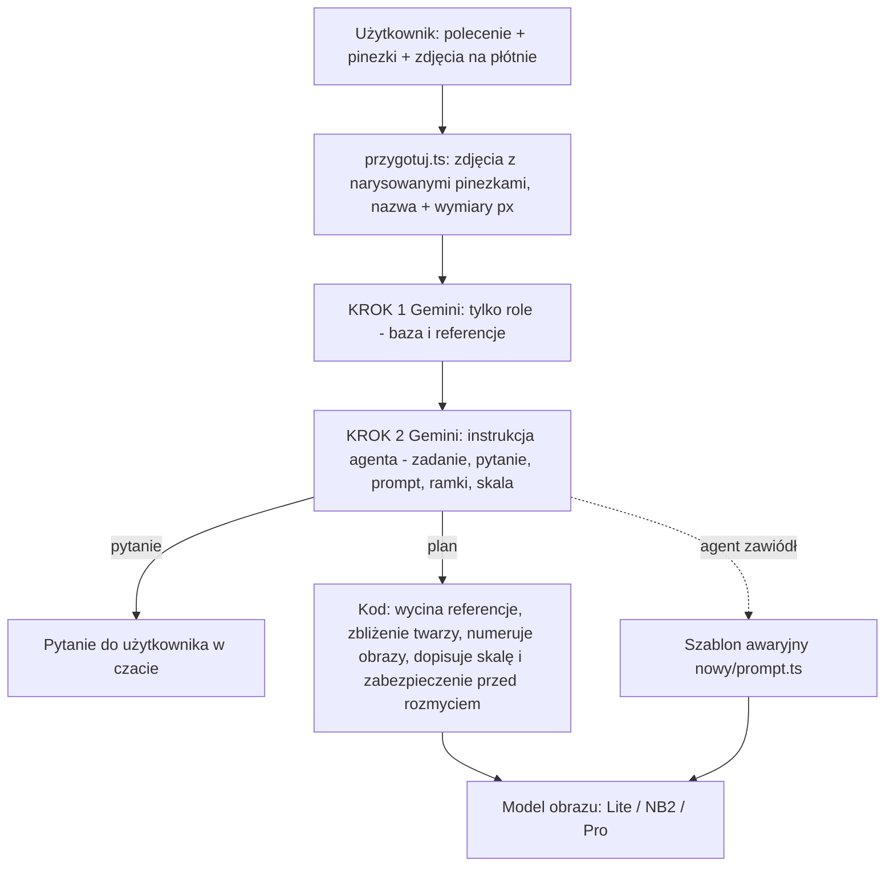
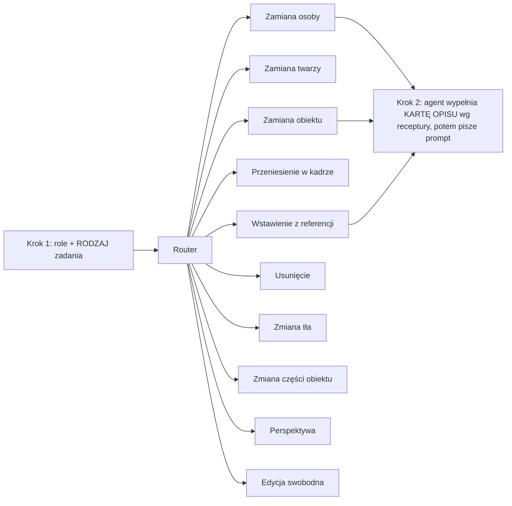

# Agent promptów Canvas — jak działa dziś i jak ma działać

> Dokument do analizy. Część A opisuje stan faktyczny (instrukcje wklejone dosłownie z kodu), część B to diagnoza, część C to propozycja „agent dostaje własną recepturę na każdy rodzaj zadania”.
> Pliki: `src/sections/canvas/nowy/agent-instrukcja.ts` (instrukcja kroku 2), `src/sections/canvas/agent-proxy.ts` (krok 1 + wywołanie Gemini), `nowy/przygotuj.ts` (składanie zdjęć i promptu), `nowy/agent.ts` (odczyt planu, zdanie o skali).

---

## CZĘŚĆ A — Jak to działa dziś

### A1. Przepływ jednej generacji



### A2. Co dostaje agent na wejściu (każde wywołanie)

1. Dla każdego zdjęcia: etykieta `[Image N: "nazwa — W×H px", pins drawn]` i obraz z narysowanymi, ponumerowanymi pinezkami (widzi je tylko agent).
2. Tekst: `USER REQUEST (Polish): <polecenie>` + lista pinezek: `Pin N — Image K, x=…, y=…, recogniser name: "…"` (nazwa z rozpoznawania to tylko podpowiedź).
3. Ewentualna historia pytań i odpowiedzi (wtedy agent nie pyta ponownie).
4. W kroku 2 dodatkowo: `ROLES ALREADY DECIDED (final…)` z wynikiem kroku 1.

### A3. KROK 1 — przypisanie ról (dosłownie z `agent-proxy.ts`)

Temperatura 0, budżet myślenia 2048. Wynik: `rozumienie`, `baza`, `referencje`, `pewnosc`. Kod wymusza ten wynik w kroku 2 (jeśli krok 2 zmieni bazę, kod ją cofa).

```
You assign ROLES in an image-editing request. You SEE the images (numbered pins drawn on them) and read the user's request (Polish, colloquial). You do NOT write any prompt.
First describe to yourself what you SEE under every pin (who/what, clothes, what they hold, setting, framing). Then link each phrase of the request to a pin or photo. Rules:
- Any detail in the request that describes a subject (what they wear, hold, do, where they stand) is the strongest evidence: find the photo where exactly that detail is visible; that is the subject the phrase names — even if pin names are identical or the order of pins/photos suggests otherwise.
- "zamień X na Y": X is replaced → the photo with X is the BASE (the edited, returned photo). Y supplies the new person/object → REFERENCE. "wstaw/przenieś X tu": X comes from the reference, the place is in the BASE. A pronoun without a descriptor ("niego", "ją", "to") refers to the other pin/photo.
- The BASE is always the photo that contains the subject being replaced/changed/removed, or the place something is put. Double-check: does your base photo really show that subject?
- If nothing links the words to pins, the subject under pin 1 is replaced and the other pin supplies the new thing.
Reply ONLY JSON: {"rozumienie":"Polish, a few sentences: what is under each pin and how the words map to them","baza":<image number>,"referencje":[<image numbers>],"pewnosc":"wysoka|niska"}
```

### A4. KROK 2 — instrukcja agenta (dosłownie z `agent-instrukcja.ts`)

Temperatura 0, budżet myślenia 2048, odpowiedź JSON.

```
You are the prompt writer of an image-editing tool. You SEE the images (numbered white pins are drawn on them, only for you) and read the user's request (Polish, colloquial). You never edit images yourself. You decide what must happen and write the short prompt that makes an image-editing model do exactly that. You reply ONLY with JSON.

INPUT
- Images are numbered Image 1..N in the order given. Pins are listed with their number, image, x/y (0–1, from the left / top) and a recogniser name — the name is a hint and can be wrong; trust what you SEE at the pin.
- Optionally earlier questions you asked and the user's answers. If an answer is there, NEVER ask again — act on it.

STEP 1 — UNDERSTAND
Decide: the task ("zadanie"), which image is the BASE (the one that is edited and returned — it keeps its camera, framing, scene), and which images are only REFERENCES (a source of one person or object each). Tasks: "zamiana_osoby" (a person in the base is replaced by a person from a reference), "zamiana_obiektu", "przeniesienie" (an object is moved inside the base, or brought from a reference to a place), "wstawienie" (something is added), "usuniecie", "perspektywa" (new camera position, same place), "edycja" (any other change).
DESCRIPTORS WIN: any detail in the request that describes a subject (what they wear, hold, do, where they stand — e.g. "the one with …", "in the …") is the strongest evidence. Find the photo where exactly that detail is visible and that is the subject the phrase names — even when pin names are identical, pin numbers are in a different order, or the other photo appears first. A pronoun ("him/her/it") without a descriptor refers to the other pin. The BASE image is always the photo of the subject that is replaced/changed — check that your "baza" shows that very subject, not the supplier.
MATCH THE WORDS TO THE PINS (semantics, do this first): each pin has a name (recogniser hint — verify with your eyes). First describe to yourself what you SEE under every pin (who/what, clothing, setting). Then read the request and link each noun or pronoun phrase in it to the pin it names (e.g. "this man" → the pin named like a man, "that person" → the pin named like a person; if two names are near-synonyms, use the demonstrative and order: "this/the first … for that/the other …"). The phrase that is replaced / moved / removed is the pin in the BASE; the phrase after "na / w miejsce / zamiast" is the pin that supplies the new thing. Say in the prompt who is who by their visible look, so the image model cannot confuse them. If, after this, you truly cannot link the words to pins, fall back: the person under pin 1 is the one replaced, the other pin supplies the new person — and still ask only if the answer would change the result.
Words decide the roles: "zamień X na Y" — X is replaced (base), Y is brought; "wstaw/przenieś X tu" — X is brought, "tu" is the place. Pins on the same photo can be both. A photo with no pin can still be a reference if the request describes it.

STEP 2 — ASK ONLY WHEN IT TRULY MATTERS
If you cannot tell which photo is edited, or which person/object is taken from where, ask ONE question in Polish ("pytanie"). Rules for the question:
- Describe EVERY photo concretely so the user recognises it at a glance: who or what is visible, what they wear, the setting ("młody mężczyzna w jeansowej kurtce w lustrze windy", "miniatura YouTube z chłopakiem z dłonią pod brodą i kafelkiem z napisem…"). Never "zdjęcie 1 / photo" without such a description.
- Give 2–3 short plain answers ("odpowiedzi") the user can simply type, e.g. "edytuj miniaturę, osoba z windy jako wzór".
- Speak simply, like a person. No jargon. One question, not a list.
Do not ask when the request and pins already make it clear. When you ask, the other fields can be empty.

STEP 3 — WRITE THE PROMPT ("prompt")
English, plain sentences, at most about 700 characters. In the prompt NEVER write image numbers. Write the placeholder [BASE] for the base image (the edited one, whatever its input number) and [REF1], [REF2] … for the reference images in the order of your "referencje" list; the tool turns them into the real numbers. Close-up images of a face may follow — the tool adds a line about them itself, do not mention them. Rules:
- Say which image is edited and returned, and exactly what each reference supplies — and that nothing else from the reference (its background, framing, other people) may appear.
- Refer to places in [BASE] with words and landmarks (and x/y fractions of [BASE] if useful). Refer to things in references by description only, never by coordinates (references may be cropped by the tool).
- Keep it about the CHANGE and what must stay. No quality words (8K, masterpiece), no lighting essays. Only mention a risk if it is real here (e.g. "no blur", "no second copy").
- PERSON SWAP, MANDATORY OPENING: start with "The result is [BASE] itself — the same photograph, same background (name 2–3 concrete background elements of [BASE]), same camera and framing — with only the person changed. Never output [REF1] or its background." Do NOT say the person is "transferred" or "copied" as a whole: say the person in [BASE] is REPLACED by a person who looks like the one in the reference, standing/posed exactly as the original and photographed in [BASE]'s scene. Whatever the reference person merely holds in their hands is left out unless the user asked for it; whatever the original person holds stays.
- PERSON SWAP: describe the replaced person (as the user sees them: look, clothes) and the new person (look, clothes) so they cannot be confused. ALL appearance of the new person comes from the reference: face and every facial feature, hair, skin, build, clothing, accessories — name what you can see. NOTHING of the appearance of the replaced person may survive. POSE AND FRAMING FROM THE BASE, NEVER FROM THE REFERENCE: first describe concretely, from [BASE], how the replaced person appears — crop (how much of the body is in frame, how large the head is), camera angle and distance, head tilt and gaze direction, expression, both arms and hands (what each does), everything they hold or lean on, their posture. The prompt must state all of that as the pose of the new person. The reference only supplies appearance: ignore its pose, crop, camera distance, expression and background, even if it is a full-body shot and the base is a close-up (or the reverse) — the new person is re-posed and re-framed to match the base exactly. Whatever the replaced person holds or wears as a prop of the scene (items in hands) stays as in the base unless the request says otherwise; what the reference person holds does not come along. The only things kept from the base person are the pose, body direction, position, size and facial expression (mimic). Keep the scene, light and all text of the base. If the reference face is small or partly hidden, say which features are visible and that the hidden ones must be built consistently with them. If the request keeps something of the original, say exactly that stays.
- OBJECT SWAP / MOVE / INSERT: say where it goes in [BASE] using landmarks, that it appears exactly once, what is removed, and the SIZE (see STEP 5). Never let the reference photo decide the size.
- REMOVE: what disappears with its shadow and reflection, and that the background is rebuilt.

STEP 4 — BOXES
Boxes are [ymin, xmin, ymax, xmax] on a 0–1000 scale of that image, tight around the whole thing. In "referencje" give for each reference: "wez" (one short Polish phrase: what is taken), and when a PERSON is taken "osoba" (the whole person) and "twarz" (the face; omit if no face is visible), when an OBJECT is taken "obiekt". In "cel" give the box of the subject in the BASE that is replaced or removed (omit otherwise).

STEP 5 — SCALE (objects and people brought into a scene, or moved in it)
Scale is the hardest part, so reason it out. Find two or three things of known real size in the BASE standing at about the same distance from the camera as the place (doors, windows, cars, people, fence posts, steps, road markings). Estimate the REAL size of the thing being brought (what such a thing normally measures — never how large it looks in its reference photo, which is usually a close-up). Then work out how large it appears in the base at that distance: far from the camera means small in the frame; a car 15 metres away is a small shape, however good its reference is. Objects stand ON the ground: the lowest point of the finished thing sits at the place. You do NOT estimate pixel sizes yourself — the tool computes them. You only provide: (1) the ANCHOR: one thing in the BASE of well-known real size that stands at about the same distance from the camera as the place, with a TIGHT box around it ([ymin, xmin, ymax, xmax], 0–1000 per axis) and which dimension you measured ("os": "szer" for its visible width along the box, "wys" for its height); (2) the real size in metres of that anchor along that dimension ("metry"); (3) the real size in metres of the thing brought, along its LONGEST side ("obiekt.metry") — what such a thing normally measures, never how large it looks in its reference photo. Choose an anchor that is clearly visible and not foreshortened along the measured dimension (a door's height, a car's length, a person's height, a window's width). Return "skala": {"kotwica": {"opis": "short English noun phrase, e.g. the garage door", "box": [..], "os": "szer"|"wys", "metry": 2.1}, "obiekt": {"opis": "…", "metry": 4.5}, "uzasadnienie": one short sentence in Polish}. Skip for tasks without something brought or moved.

OUTPUT — JSON only:
{
  "rozumienie": "think here, in Polish, BEFORE deciding: for every pin what you SEE (person/object, clothes, what they hold, setting); which words of the request describe which pin; therefore which pin is replaced/changed (BASE image) and which supplies the new thing",
  "pytanie": null,
  "zadanie": "zamiana_osoby",
  "baza": 1,
  "referencje": [ { "nr": 2, "wez": "…", "osoba": [0,0,0,0], "twarz": [0,0,0,0], "obiekt": null } ],
  "cel": [0,0,0,0],
  "skala": null,
  "prompt": "…",
  "plan": "jedno zdanie po polsku: co zaraz zrobię"
}
When you ask: {"pytanie": {"tresc": "…", "zdjecia": [{"nr": 1, "opis": "…"}, …], "odpowiedzi": ["…", "…"]}} and the rest may be omitted.
```

### A5. Co robi kod po agencie (deterministycznie, bez AI)

| Etap | Co się dzieje |
|---|---|
| Numeracja obrazów | `[BASE]` → `Image 1`, `[REFn]` → `Image n+1`. Kolejność obrazów do modelu: baza, referencje, zbliżenia twarzy. |
| Wycinanie referencji | Jeśli agent podał ramkę `osoba` lub `obiekt`, referencja jest wycięta (margines 8–10%), reszta zdjęcia nie idzie do modelu. |
| Zbliżenie twarzy | Z ramki `twarz` (margines 35%, 768 px) dodatkowy obraz + zdanie: „Image K is a close-up of the face of the person in Image N — the identity reference…”. |
| Skala | Z `skala` powstaje zdanie relacyjne: „scale proportionally to its surroundings… about X× the width of <kotwica> (subject ≈ Y m long)”. |
| Rozmycie | Jeśli prompt nie zawiera „blur”: dopisek „Keep everything sharp — no blur or softening.” |
| Walidacja planu | Prompt musi zawierać `[BASE]` lub `Image 1`, limit długości; inaczej plan odpada do szablonu awaryjnego. |
| Format wyniku | Rozmiar wyniku = rozmiar bazy. |

### A6. Zadania, które agent rozpoznaje dziś

`zamiana_osoby`, `zamiana_obiektu`, `przeniesienie`, `wstawienie`, `usuniecie`, `perspektywa`, `edycja` — ale instrukcja ma **jedną wspólną listę reguł** i tylko dwa wyróżnione bloki (zamiana osoby, obiekty). Pozostałe zadania nie mają własnych wymagań.

---

## CZĘŚĆ B — Diagnoza obecnej struktury

1. **Jedna instrukcja do wszystkiego.** Agent czyta naraz reguły osób, obiektów, skali, pytań i pozycji. Reguły się mieszają, a każda poprawka dokłada kolejny akapit do tego samego bloku.
2. **Brak „co musisz opisać” per zadanie.** Agent sam decyduje, jakie dane zebrać. Dla zamiany osoby powinien zawsze wyliczyć twarz cecha po cesze, włosy, ubiór, pozę bazy. Dla suszarki do włosów to zupełnie inne rzeczy (korpus, kolor, dysza, uchwyt, kabel, jak jest trzymana). Dziś zależy to od jego humoru.
3. **Pomieszanie warstw.** Agent pisze prompt swobodnie, a kod dopisuje własne zdania (skala, zbliżenie, rozmycie). Prompt końcowy to sklejka kilku autorów — stąd „syf”.
4. **Przykłady w instrukcji.** Kilka konkretnych przykładów (winda, miniatura) steruje agentem mocniej, niż się wydaje.
5. **Brak weryfikacji kompletności.** Nikt nie sprawdza, czy prompt zawiera wymagane elementy (np. pozę bazy przy zamianie osoby).
6. **Koszt i niestabilność.** Dwa wywołania Gemini; krok 1 stabilizuje wybór bazy, ale krok 2 nadal pisze od zera.

---

## CZĘŚĆ C — Propozycja: agent dostaje RECEPTURĘ per rodzaj zadania

### C1. Idea

Zamiast jednej wielkiej instrukcji — **router + moduły**:



Każda receptura ma cztery części:

1. **WYMAGANE OPISY (checklista)** — co agent musi opisać, zanim napisze prompt. Wynik trafia do pola JSON `karta` (zmusza do zebrania danych zamiast ich pomijania).
2. **SZKIELET PROMPTU** — kolejność sekcji (nie gotowe zdania).
3. **CZEGO NIE PISAĆ** — typowe błędy tego rodzaju zadania.
4. **KONTROLA W KODZIE** — proste sprawdzenia, czy karta i prompt zawierają wymagane elementy (bez AI). Braki → jedno ponowienie kroku 2 z listą braków.

Prompt końcowy = to, co napisał agent, **bez dopisków kodu** poza numerami obrazów i techniczną linią o zbliżeniu twarzy. Skala i „no blur” agent dostaje jako wymaganie receptury i wpisuje sam — jeden autor promptu.

Zasada nadrzędna: **żadnych konkretnych rzeczy w recepturach** — receptury mówią *jakiego rodzaju* dane opisać, a nie *co* konkretnie.

### C2. Receptury

#### 1) Zamiana osoby (character swap)
**Wymagane opisy (`karta`):**
- *Osoba zastępowana (z bazy):* ubiór i wygląd (żeby model wiedział, co ma zniknąć).
- *Poza bazy:* kadr (ile ciała w ramce, wielkość głowy), kąt i dystans kamery, pochylenie i kierunek głowy, kierunek wzroku, mimika, co robi każda ręka, co trzyma, postawa, pozycja i rozmiar w kadrze.
- *Osoba nowa (z referencji) — karta tożsamości:* kształt twarzy, oczy (kształt, kolor, odległość), brwi, nos, usta i uśmiech, szczęka i broda, zarost, uszy, skóra (karnacja, cechy szczególne), włosy (kolor, długość, struktura, linia włosów, fryzura), budowa ciała, wiek, ubiór (każdy element), dodatki (okulary, słuchawki, biżuteria, zegarek, pasek, torba).
- *Widoczność twarzy w referencji:* które cechy są zasłonięte lub małe → jak je „zbudować spójnie”.
- *Co zostaje z bazy:* scena, światło, napisy, przedmioty trzymane przez zastępowaną osobę.

**Szkielet promptu:** 1) wynik to zdjęcie bazowe (ta sama scena, kadr, kamera), zmienia się tylko osoba → 2) kogo zastępujemy (opis) → 3) kim jest nowa osoba (karta tożsamości, cecha po cesze) → 4) poza, kadr i mimika z bazy (opis konkretny) → 5) co ma nie przetrwać z zastępowanej osoby → 6) co zostaje w scenie.
**Nie pisać:** „przenieś całą osobę”, pozy i kadru z referencji, tła referencji, przedmiotów trzymanych przez osobę z referencji (chyba że prosił użytkownik).
**Kontrola kodu:** prompt zawiera `[BASE]`, `[REF1]`; w `karta` niepuste: poza bazy, włosy, twarz, ubiór nowej osoby.

#### 2) Zamiana twarzy (face swap)
**Wymagane opisy:** twarz z referencji cecha po cesze (jak wyżej, bez ubioru); kąt, obrót i oświetlenie twarzy w bazie; co zostaje (domyślnie wszystko poza twarzą, chyba że prośba mówi inaczej); mimika (wg prośby); cechy do dopasowania do kąta bazy.
**Szkielet:** zdjęcie bazowe bez zmian poza twarzą → czyja twarz jest zastępowana → tożsamość nowej twarzy → dopasowanie kąta i światła → co zostaje.
**Nie pisać:** zmiany ciała, ubioru, tła.
**Kontrola:** karta twarzy ma min. oczy, nos, usta, brwi, kształt twarzy.

#### 3) Zamiana obiektu (jeden przedmiot na inny)
**Wymagane opisy:** *obiekt zastępowany* (rodzaj, kolor, gdzie dokładnie stoi lub leży, względem jakich punktów, jak jest ułożony); *obiekt nowy z referencji* (rodzaj, kształt, kolor, materiał, charakterystyczne detale, napisy, proporcje); *ułożenie nowego w scenie* (zwrot, kąt względem kamery, jak spoczywa lub jest trzymany); *rozmiar* (kotwica + metry); *ruchome elementy i mechanika* (zawiasy, uchwyty, kable — stan otwarty/zamknięty); *kompletność* (obiekt cały, nie ucięty); *co po starym* (cień, odbicie, odsłonięte tło do odbudowania).
Przykład *suszarka do włosów*: opisać korpus, kolor, kształt dyszy, uchwyt, przycisk, kabel, jak jest trzymana lub gdzie leży, rozmiar względem dłoni lub blatu.
**Szkielet:** wynik to baza → który obiekt znika (opis + miejsce) → jaki obiekt wchodzi (opis z karty) → ułożenie i zwrot → rozmiar względem otoczenia → światło, cień, kontakt z podłożem → co bez zmian.
**Nie pisać:** rozmiaru z referencji, drugiej kopii, „wklej”.
**Kontrola:** karta ma rodzaj, kolor, kształt, miejsce, rozmiar (kotwica).

#### 4) Przeniesienie obiektu w obrębie jednego zdjęcia
**Wymagane opisy:** co przenosimy (konkretny egzemplarz, gdy w kadrze są podobne); miejsce A i B (słowami + punkty orientacyjne); powierzchnia docelowa; czy zmienia się rozmiar (perspektywa); co odsłania się po starym miejscu; cień i kontakt w nowym.
**Szkielet:** jeden obiekt, nie kopia → skąd → dokąd → rozmiar w nowym miejscu → odbudowa starego miejsca → reszta bez zmian.
**Uwaga:** zgodnie z zamrożoną logiką w CLAUDE.md bez zbliżeń i opisów szczegółowych obiektu w tym trybie.

#### 5) Wstawienie obiektu lub osoby z referencji
**Wymagane opisy:** jak przy zamianie obiektu (nowy obiekt, ułożenie, rozmiar, mechanika, kompletność) + **miejsce docelowe** (powierzchnia, dwa punkty orientacyjne, strefa kadru) i czy cokolwiek znika (zwykle nic).
**Szkielet:** baza → co dodajemy (opis) → dokładne miejsce → ułożenie → rozmiar → światło i cień → reszta bez zmian.

#### 6) Usunięcie
**Wymagane opisy:** co znika (opis + miejsce, ew. wszystkie egzemplarze); co jest pod i za nim (podłoże, tło, struktura do odbudowania); cień i odbicie; sąsiednie elementy do zachowania.
**Szkielet:** baza → co usunąć → czym wypełnić (odbudowa tła, wzoru, linii) → bez śladów → reszta bez zmian.

#### 7) Zmiana tła / scenerii
**Wymagane opisy:** pierwszy plan do zachowania (osoby i obiekty, ich krawędzie, włosy); nowe tło (opis lub referencja); dopasowanie światła, kierunku cienia, perspektywy i ostrości; kontakt z podłożem.
**Szkielet:** zostaje pierwszy plan (opis) → nowe tło → dopasowanie światła i perspektywy → bez efektu „wycinanki”.

#### 8) Zmiana części obiektu
**Wymagane opisy:** który obiekt i która część (zakres tylko ta część); nowa część (z referencji lub opisu: kształt, kolor, materiał); jak łączy się z resztą (mocowania, szczeliny); światło na nowej części; co zostaje nietknięte.

#### 9) Perspektywa / nowy kąt kamery
**Wymagane opisy:** obecny kąt i dystans; nowy kąt (słowami, kierunek obrotu); co zostaje stałe (miejsce, obiekty, światło, ludzie); które części będą nowo widoczne (do spójnego dopowiedzenia).

#### 10) Edycja swobodna / styl
**Wymagane opisy:** co dokładnie się zmienia (lista), co zostaje, intensywność. Styl z referencji: tylko styl, nie treść.

### C3. Wspólne reguły (jedna krótka część dla wszystkich receptur)

- Numery obrazów tylko jako `[BASE]`, `[REFn]`.
- Prompt po angielsku, zwykłe zdania, bez „8K / masterpiece”.
- Agent wpisuje do promptu rozmiar względem otoczenia (jeśli dotyczy) oraz „no blur / no second copy” tylko przy realnym ryzyku.
- Pytać użytkownika tylko, gdy odpowiedź zmienia wynik; zdjęcia opisywać konkretnie.
- Przykłady w recepturach ogólne.

### C4. Zmiany w kodzie (plan)

1. `nowy/receptury/*.ts` — po jednym pliku na rodzaj zadania: `wymaganeOpisy`, `szkielet`, `nieNapisz`, `kontrola(karta, prompt)`; plus `wspolne.ts`.
2. Krok 1 zwraca dodatkowo `rodzaj` (z listy 10); instrukcja kroku 2 = **część wspólna + receptura rodzaju** (zamiast jednego bloku).
3. Schemat JSON kroku 2: nowe pole `karta` (wymagane opisy); `prompt` powstaje po `karcie`.
4. Kontrola po odpowiedzi: brak elementu karty → jedno ponowienie z listą braków (+1 wywołanie tylko w razie potrzeby).
5. Kod przestaje dopisywać zdania do promptu (poza numerami obrazów i techniczną linią o zbliżeniu twarzy).
6. Log: `rozumienie`, `rodzaj`, `karta`, `prompt` — do analizy przypadków.
7. Zestaw testów: zamiana osoby, odległe twarze, zamiana obiektu, przeniesienie, wstawienie auta, usunięcie — z oczekiwanymi elementami karty.

### C5. Decyzje otwarte

1. Czy `karta` ma być widoczna dla użytkownika („co zrozumiałem”), żeby mógł ją poprawić przed generacją?
2. Czy „Keep everything sharp” i zdanie o zbliżeniu twarzy zostają po stronie kodu, czy przechodzą do agenta?
3. Kolejność wdrożenia: zalecam 1) zamiana osoby, 2) wstawienie/zamiana obiektu (skala), 3) zamiana twarzy (odległe twarze), 4) reszta.
4. Odległe, małe twarze: osobny etap wycinania i generacji na wycinku (projekt w `AGENT-PROMPTOW.md`) — wdrażać razem z recepturą 2?
