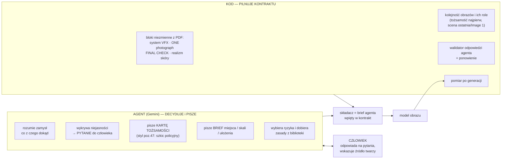
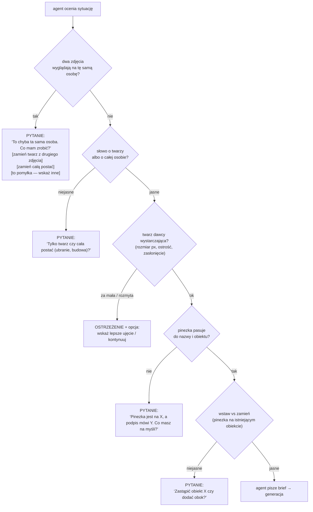

# Tryb AGENT zamiast tryb WYKONAWCA — specyfikacja promptów

Cel: Gemini dostaje **zamysł** (zdanie, pinezki, zdjęcia), sam rozumie sytuację i **sam pisze brief** dla modelu obrazu. Kod trzyma tylko to, co nie podlega negocjacji (kontrakt jakości z PDF Studia). Nie ma „zrób tak, tak, tak” w kodzie — jest zestaw zasad, z których agent składa prompt, i lista sytuacji, w których agent ma **zapytać człowieka** zamiast zgadywać.

Źródło wiedzy: PDF „Studio Zdjęć — prompty systemowe” (poz. 4, 6, 7, 19–23, 28–37, 47–50, 52).

## 1. Podział odpowiedzialności

## 2. Co agent dostaje (wejście)

1. Zdania użytkownika (dosłownie) i nazwy pinesek.
2. Wszystkie zdjęcia, każde z naniesionymi pinezkami + **zbliżenie** wokół każdej pinezki + **zbliżenie twarzy** każdej osoby w kadrze (jeśli wykryta).
3. Role pinesek ustalone przez kod (jako fakty, nie jako polecenia): kto jest zamieniany, kto dawcą, obiekt vs miejsce.
4. Metadane zdjęć: rozdzielczość, rozmiar twarzy w pikselach, orientacja, czy kadr jest wycinkiem wideo.
5. Zdania z biblioteki zasad (sekcja 4) — jako **wiedza**, nie jako szablon.

## 3. Co agent MA zdecydować (lista decyzji)

| # | Decyzja | Reguła |
|---|---|---|
| 1 | Rodzaj operacji | face swap (tylko słowo o twarzy) · character swap · wstaw · przenieś · zamień · usuń |
| 2 | Czy to ta sama osoba na obu zdjęciach? | patrz sekcja 5 — **pytanie** |
| 3 | Co jest źródłem tożsamości, a co sceną | scena = Image 1, tożsamość = reszta; zbliżenie twarzy pierwsze |
| 4 | Co zachować ze sceny, co wziąć z referencji | face: tylko twarz; character: osoba + ubranie z referencji (chyba że „zachowaj ubranie”) |
| 5 | Karta tożsamości dawcy | pola jak poz.47 (twarz, oczy, nos, usta, skóra, włosy, ciało, znaki, „nie zmieniaj”) — **tylko to, co widać** |
| 6 | Miejsce docelowe | opis względem 2 landmarków + powierzchnia; bez współrzędnych |
| 7 | Skala | jedno porównanie z prawdziwych wymiarów do 1 landmarku |
| 8 | Czy coś jest mechaniczne | drzwi, pokrywy — zawias i kierunek |
| 9 | Czy fragment referencji wymaga dokończenia | portret głowy → cały obiekt |
| 10 | Ryzyko jakości | mała twarz, niska rozdzielczość, kontr-światło, okulary/ręka zasłaniają |

## 4. Biblioteka zasad (wiedza agenta) i bloki niezmienne (kod)

**Niezmienne — kod dokleja, agent nie edytuje (z PDF):**
- system VFX: poz.19 (character) / poz.28 (face) — *re-photograph, nie wklejaj*,
- ONE photograph (poz.4): światło, perspektywa, cienie kontaktowe, ziarno,
- FINAL CHECK (poz.20 / poz.30): „czy to ta SAMA osoba co w referencjach — kształt twarzy, oczy, nos, usta, znaki, włosy?",
- realizm skóry (poz.35): pory, meszek, asymetria, ziarno jak w reszcie kadru,
- role referencji (poz.7),
- negatywy (poz.32/37) — Google ich nie przyjmuje, więc wchodzą jako jedno zdanie **„unikaj: …”** w prompcie.

**Biblioteka — agent czerpie, przeformułowuje i dobiera (z PDF + naszych testów):**
- Identity lock (poz.49/50): „preserve EXACTLY the same person… DO NOT CHANGE: …".
- „Transfer identity by reconstructing facial geometry…" (poz.29).
- Zasady zachowania okluderów (włosy, okulary, ręce zostają przed twarzą).
- Zasady kompozytu (poz.52): konkretne światło w Kelvinach, kierunek cieni, odbicia koloru, punkty styku; **zakaz** ogólników („dopasuj światło").
- Własne: pełne zdjęcie od zera, kompletny obiekt, mechanika, jedno porównanie rozmiaru, kotwice i horyzont.

## 5. Kiedy agent PYTA zamiast zgadywać

Format odpowiedzi agenta gdy pyta: `{ "pytanie": { "powod": "…", "opcje": [{"id":"twarz","etykieta":"Tylko twarz z zdjęcia 2"},{"id":"postac","etykieta":"Cała postać"},{"id":"wskaz","etykieta":"Wskaż inne zdjęcie"}] } }` — UI pokazuje przyciski w czacie (jest już mechanizm pytań o role). Odpowiedź wraca do agenta jako fakt i dopiero wtedy pisze brief.

## 6. Face swap — dokładna specyfikacja (PDF poz.28–37, 47–50)

Kolejność bloków w prompcie (jak w Studiu, wagi 1–5):
1. **Baza** (poz.29), agent tylko wskazuje numery obrazów: *create a single photorealistic image using Image 1 as the exact base photo; preserve body, pose, head angle, expression, gaze, clothing, hair placement, hands, occlusions, background, camera, lighting, color grade, composition. Use Image(s) N as identity source — they ALL show the SAME person… Transfer identity by reconstructing facial geometry: face shape, eye shape and spacing, brows, nose, mouth, jaw/chin/cheekbones, skin undertone, age cues, unique marks, realistic skin texture. Relight and recolor the identity; blend forehead, temples, cheeks, jaw, ears, neck, hairline without a boundary. Preserve occluders. Do not copy the source crop, expression, lighting, background, borders or any oval/rectangular patch. Do not change body, clothes, pose, hairstyle, environment, framing.*
2. **Kotwica** FINAL CHECK (poz.30).
3. **Rdzeń zamka tożsamości** — **pisze agent** (styl poz.47/49): znaki szczególne, „DO NOT CHANGE", twarz, oczy, włosy — tylko obserwowalne fakty, „not clearly visible" pomijane.
4. **Realizm skóry** (poz.35).
5. **Reszta zamka** (poz.50): skóra, nos, usta, sylwetka, ubiór (najniższy priorytet, przycinana).
6. Zdanie **„unikaj”** złożone z negatywu poz.32+37.
Parametry: system poz.28, temperatura 0.42, Pro. Obrazy: **zbliżenia twarzy dawcy (do 4, close-up pierwszy)**, scena. Brak instrukcji użytkownika w samej bazie (poz.31) — jego zdanie agent przetwarza na decyzje, nie wkleja.
Opcjonalny **polish pass** (poz.33, temp. 0.2): wynik → wygładzenie szwów i ujednolicenie światła, bez wyostrzania.

## 7. Twarze w oddali (bardzo ważne testy)

Mała twarz (kilkadziesiąt pikseli) nie przeniesie tożsamości — zarówno u dawcy, jak i w scenie. Agent ma to **wykryć i powiedzieć**, a kod ma procedurę:
- twarz dawcy < ~200 px: ostrzeżenie + prośba o lepsze ujęcie;
- twarz w scenie mała: generacja na **powiększonym wycinku** wokół twarzy (kod już ma wycinek i skład: `GENERUJ_NA_WYCINKU`), potem wklejenie z miękką maską — bo model nie odtworzy twarzy 40 px;
- zawsze FINAL CHECK porównania z referencją (pomiar tożsamości: podobieństwo osadzeń twarzy, jeśli dodamy).

## 8. Walidator odpowiedzi agenta (żeby „inteligentny” nie znaczyło „nieprzewidywalny”)

- brak współrzędnych i procentów w briefie, brak numerów pinesek,
- dokładnie **jedno** porównanie rozmiaru i **jedna** operacja,
- brak sprzeczności typu „mniejsze niż X” bez stosunku,
- wszystkie wymagane punkty (co/gdzie/co usunąć/jak/rozmiar) obecne,
- długość w limicie; przy naruszeniu — ponowienie z komunikatem błędu (do 3×), potem fallback do szablonu z kodu.

## 9. Decyzje do podjęcia

1. Czy agent ma **zawsze** pytać przy podobieństwie twarzy, czy tylko gdy pewność > 80%?
2. Czy karta tożsamości ma być robiona **osobnym wywołaniem** (jak poz.47, 1 ⟠) czy w jednym JSON z planem?
3. Face swap z wycinka (sekcja 7): włączamy domyślnie dla twarzy < N px?
4. Polish pass (poz.33) — domyślnie włączony dla face swap, kosztem drugiej generacji?
