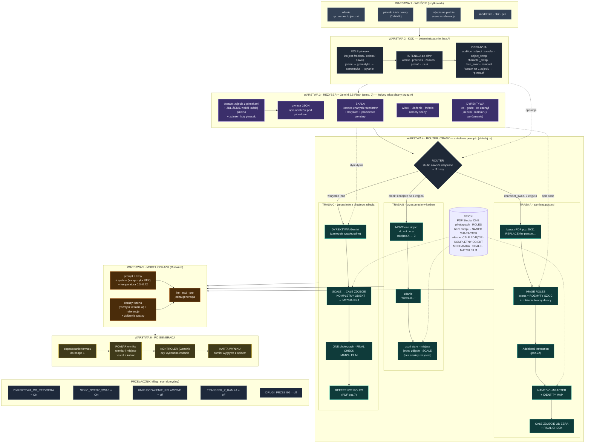

# System promptowania Canvasa — wszystkie warstwy w jednym diagramie

Wklej blok poniżej do https://mermaid.live albo otwórz ten plik na GitHubie (renderuje się sam). Diagram jest szeroki: każda **warstwa** to jeden poziomy pas, idziesz z góry na dół.

**Kolory warstw:** szary = wejście i kod bez AI · fiolet = Gemini (jedyny tekst od AI) · turkus = trasy składania promptu · pomarańcz = model obrazu · żółty = kontrola po generacji.
**Linia przerywana:** dane doklejane z boku (operacja i dyrektywa z reżysera trafiają do konkretnej trasy; bricki do konkretnego bloku).
