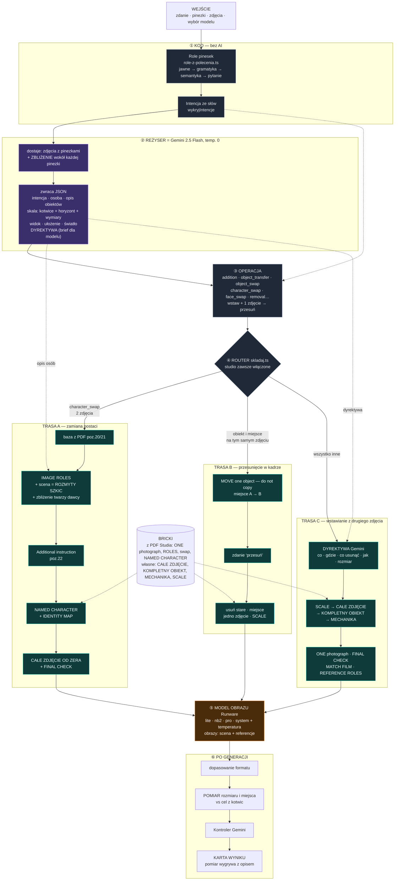

# System promptowania Canvasa — jeden diagram

**Jak czytać:** idź z góry na dół. Fioletowy blok to jedyne miejsce, gdzie pisze Gemini. Niebieskozielone trasy A/B/C to składanie promptu, a pomarańczowy to model obrazu. Linia przerywana to dane, które są dołączane z boku. Trasa wybierana jest tylko w routerze.
