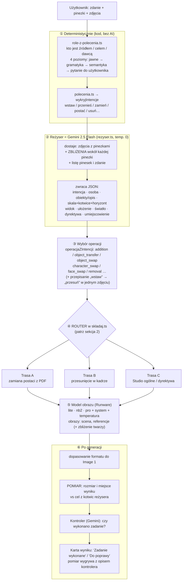
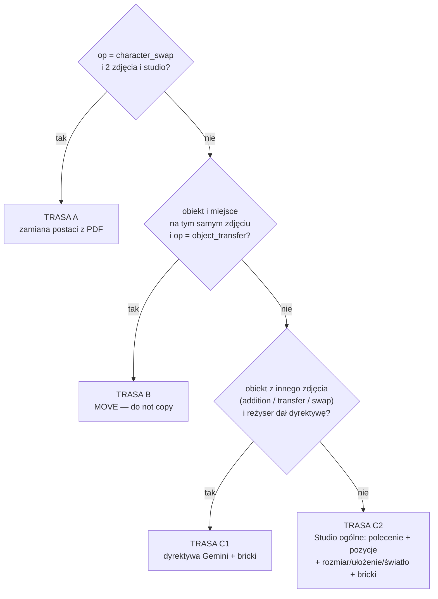
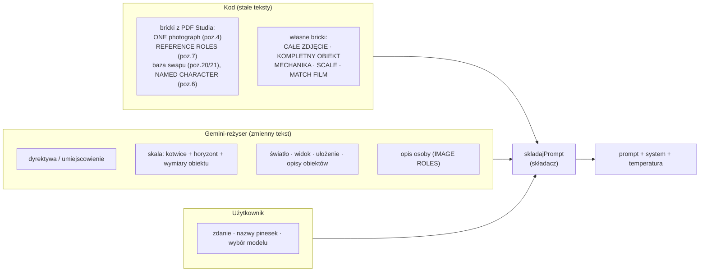
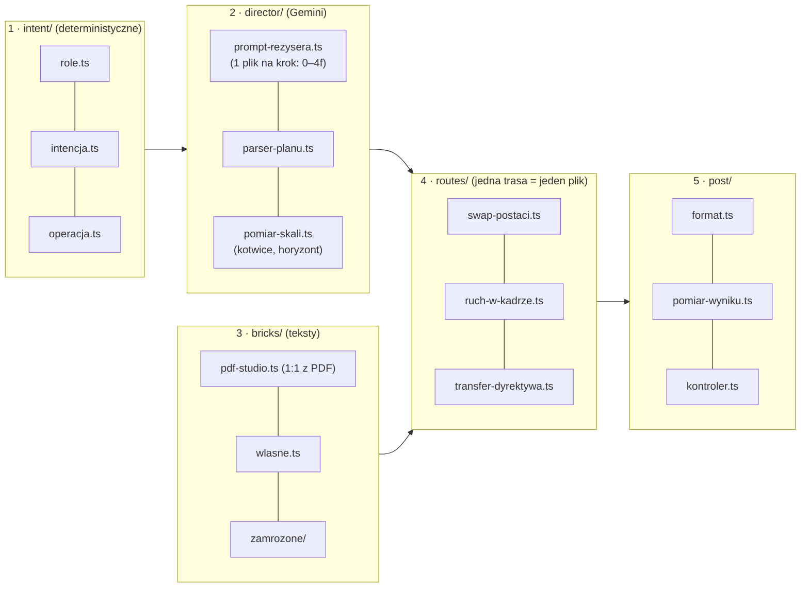

# System promptowania Canvasa — mapa na jednej stronie

Stan na 07.10.2026. Wszystkie diagramy to Mermaid (GitHub renderuje je sam; lokalnie: VS Code „Markdown Preview Mermaid”).

## 0. Najważniejszy wniosek

W aplikacji `studio` jest zawsze włączone, więc **prompt idzie jedną z trzech tras** (reszta kodu — krótkie prompty „dodaj / twarz / ubranie…”, zamrożone tryby scenerii itd. — jest w trybie Studio martwa):

| Trasa | Kiedy | Model | System / temp. |
|---|---|---|---|
| **A. Zamiana postaci z PDF** | `character_swap`, 2 zdjęcia | Pro / wybrany | VFX-kompozytor, 0.3 (szkic sceny) |
| **B. Przesunięcie w kadrze** | obiekt i miejsce na tym samym zdjęciu | wybrany | bez systemu, 0.72 |
| **C. Studio ogólne** (+ dyrektywa) | wszystko inne, w tym wstawianie / zamiana obiektu z drugiego zdjęcia | wybrany | kompozytor, 0.35 (transfer) albo 0.72 |

## 1. Cały przepływ (od kliknięcia „Wyślij” do karty wyniku)

## 2. Router — którą trasą idzie prompt (`skladaj.ts`)

## 3. Co dokładnie składa się w każdej trasie (kolejność bloków = kolejność w prompcie)

```mermaid
flowchart LR
  subgraph TA["TRASA A — zamiana postaci"]
    A1["① baza z PDF poz.20/21<br/>(REPLACE the person… take ONLY identity)"] --> A2["② IMAGE ROLES<br/>scena vs referencja + opis osób od reżysera<br/>+ ‘scena to ROZMYTY SZKIC’"]
    A2 --> A3["③ Additional instruction<br/>(zdanie użytkownika, poz.22)"]
    A3 --> A4["④ NAMED CHARACTER + IDENTITY MAP<br/>(PDF poz.6 + brick Człowiek)"]
    A4 --> A5["⑤ GENERATE WHOLE IMAGE FROM SCRATCH<br/>cały człowiek od zera, strój z referencji"]
    A5 --> A6["⑥ FINAL CHECK poz.20 + ‘swap is mandatory’"]
  end
  subgraph TB["TRASA B — przesunięcie w kadrze"]
    B1["① MOVE one object — do not copy<br/>miejsce A → miejsce B (słowami + x/y)"] --> B2["② [USER] zdanie (‘wstaw’ → ‘przesuń’)"]
    B2 --> B3["③ [RULES]: usuń stare · miejsce · jedno zdjęcie · SCALE<br/>(bez analizy reżysera)"]
  end
  subgraph TC["TRASA C1 — wstawianie z drugiego zdjęcia"]
    C1["① DYREKTYWA Gemini<br/>co · gdzie względem landmarków · co usunąć<br/>jak stoi · rozmiar (1 porównanie)"] --> C2["② SCALE (ogólny)"]
    C2 --> C3["③ CAŁE ZDJĘCIE OD ZERA"]
    C3 --> C4["④ KOMPLETNY OBIEKT<br/>(fragment → całość)"]
    C4 --> C5["⑤ MECHANIKA<br/>(zawiasy, drzwi)"]
    C5 --> C6["⑥ ONE photograph + FINAL CHECK + MATCH FILM"]
    C6 --> C7["⑦ REFERENCE ROLES (PDF poz.7)"]
  end
```

## 4. Kto co pisze (źródło każdego fragmentu)

## 5. Co robi reżyser (ściąga pól)

| Pole | Treść | Gdzie trafia |
|---|---|---|
| `intencja`, `osoba` | operacja; czy chodzi o człowieka | router, `operacjaZIntencji` |
| `obiekty[].opis / miejsce / szczegoly` | identyfikacja tego pod pinezką (na bazie zbliżenia) | karta pinezki, opis w rolach |
| `skala`, `kotwice[]`, `horyzont`, `obiekt` | prawdziwe wymiary + znane rozmiary + linia horyzontu | liczy kod (`skalaWRzedzie`) → % szerokości kadru → pomiar po generacji |
| `widok`, `ulozenie`, `swiatlo` | kamera, powierzchnia, światło sceny | linie w trasie C2 |
| `dyrektywa` | **jedno** zdanie-brief dla modelu obrazu | trasa C1 (zastępuje pozycje, rozmiar, ułożenie) |
| `umiejscowienie` | relacyjne miejsce (eksperyment, wyłączony) | flaga `UMIEJSCOWIENIE_RELACYJNE` |

## 6. Przełączniki (flagi) — stan domyślny

| Flaga | Plik | Wartość | Efekt |
|---|---|---|---|
| `DYREKTYWA_OD_REZYSERA` | `prompty/skladaj.ts` | **true** | trasa C1 zamiast C2 |
| `SZKIC_SCENY_SWAP` | `canvas/szkic-sceny.ts` | **true** | scena w trasie A rozmyta (nie da się skopiować pikseli) |
| `UMIEJSCOWIENIE_RELACYJNE` | `prompty/skladaj.ts` | false | eksperyment relacyjny |
| `TRANSFER_Z_RAMKA` / `_WKLEJKA` | `CanvasSection.tsx` | false / (nieaktywne) | ramka lub wklejka z rozmiarem |
| `DRUGI_PRZEBIEG` | `CanvasSection.tsx` | false | druga generacja (korekta po pomiarze) |
| `GENERUJ_NA_WYCINKU`, `POSTPROCES_ZIARNA`, `KROPKI_NA_ZDJECIACH` | `CanvasSection.tsx` | false | wyłączone |
| `ZBLIZENIA_W_POBLIZU_PINEZKI`, `REFERENCJA_WOKOL_RZECZY`, `SKALA_OD_MODELU` | `CanvasSection.tsx` | true | pomocnicze zbliżenia i pomiar skali |

## 7. Mapa błędów: objaw → przyczyna → gdzie poprawić

| Objaw | Najczęstsza przyczyna | Miejsce |
|---|---|---|
| Obiekt za duży / za mały | pomiar reżysera (kotwice, horyzont, wymiary kategorii) albo model ignoruje liczby | `rezyser.ts` (STEP 4), pomiar po generacji |
| Obiekt w złym miejscu | reżyser źle odczytał pinezkę (mały obiekt obok większego) | zbliżenia pinesek, reguła CROSSHAIR FIRST |
| „Przyklejony” obiekt / twarz | model kopiuje piksele referencji lub sceny | brick CAŁE ZDJĘCIE, szkic sceny (trasa A) |
| Ucięty fragment zamiast całości | referencja to portret / zbliżenie | brick KOMPLETNY OBIEKT + dyrektywa |
| Kopia zamiast przesunięcia | „wstaw” przy obiekcie i miejscu na jednym zdjęciu | przepisanie na „przesuń”, trasa B |
| Zła osoba zamieniana | role z grammatyki zdania | `role-z-polecenia.ts` |
| Błąd „Agent nie zwrócił planu” | ucięty/niepoprawny JSON reżysera | 3 próby, limit 8192 w `agent-proxy.ts` |
| Kontroler pisze „zgodnie z poleceniem” przy złym wyniku | opis z planu zamiast pikseli | pomiar wygrywa w `CanvasSection.tsx` |

## 8. Proponowane rozbicie na moduły (do dalszej przebudowy)

Dziś `skladaj.ts` robi 2–4 naraz (~800 linii z mnóstwem martwych gałęzi). Rozbicie wg diagramu: trasy A/B/C jako osobne funkcje przyjmujące ten sam wejściowy obiekt `W`, bricki w jednym katalogu, usunięcie martwych gałęzi (tryby bez Studio).
